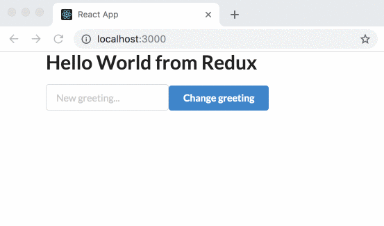

# Redux - as basic as it gets

**A central concept of React is the component “state” — a JavaScript object that determines how a component renders and behaves. With Redux, the state of an application is kept in a global store, allowing components to access it (on a need-to-have-basis). Redux is not the only way to manage state — on the contrary. It’s a very popular pattern though, widely used in many applications and thus becomes a valuable skill for any developer in general and those working on react based applications in particular.**

There are plenty of resources out there on how to get started with Redux. So why write yet another one. In my work as a coach at a coding bootcamp, I get to introduce junior developers to a lot of programming concepts — state management with Redux being one of them. And to be honest, I find Redux hard to explain. I sat down to write this post because I wanted to scale down on complexity and create a step-by-step introduction to Redux that would make my job easier.

**This is not an in-depth dive into Redux — this is a Hello World post. Hello World is where we all get started.**

Let’s get after it.

## Part 1 - Hello World

### Getting Started

Our first objective will be to create a new React application using the `create-react-app` script. I'm using `yarn` so the command is slightly different than the one you might be used to if you are a `npm` user.

```
$ yarn create react-app hello_world_redux_demo
```

Make sure to `cd` into your newly created application folder and open your application in your code editor. I'm using VSCode with CLI commands enabled, so I can open my project with a single terminal command:

```
$ cd learning_redux_demo
$ code .
```

I would also suggest that you fire up the development server and take a look at your app in the browser. You can actually keep it running while you make changes to your code for the most part. The hot reloading allows you to do that and instantly see your changes come across in the browser. For the most part anyway (sometimes you DO have to restart your server, so please keep that in mind).

I usually take a moment to clean up the scaffolded code. IMO, we should always keep our code base clean and avoid having too many files if we don’t need them. I also get rid of some of the `css` and `test` files, as well as the `svg` file with the spinning React logo. I suggest that you do the same. As a personal preference, I also change the suffix on the `App` component to `.jsx`. 

Your folder and file structure should look something like this:

```
├── README.md
├── node_modules
├── package.json
├── public
│   ├── favicon.ico
│   ├── index.html
│   └── manifest.json
├── src
│   ├── App.jsx
│   ├── index.js
│   └── serviceWorker.js
└── yarn.lock
```
You will note a few errors in your browser as you delete the files. That is, of course, caused by the imports in your `index.js` and `App.jsx`. Make sure that none of the deleted files are being imported in any of these two files. At this stage, I usually also clean up the returned `jsx` by the `App` component.

```javascript

// src/index.js
import React from 'react';
import ReactDOM from 'react-dom';
import App from './App';
import * as serviceWorker from './serviceWorker';

ReactDOM.render(<App />, document.getElementById('root'));
serviceWorker.unregister();
```

```javascript
// src/App.jsx
import React from 'react';

const App = () => { {
  return (
    <>
      <h1>
        Hello World
      </h1>
    </>
  );
}

export default App;
```

**At this stage, we have a "Hello World" application, up and running. So far, so good.**

### CSS
We will use Semanic-UI to add some styling to our application. You can, of course, choose any other CSS framework or totally omit the styling part if you want. I really like the SemanticUI library and the available wrapper for React, so I'll go ahead and use it in this demo.

I'll start by adding the dependencies using `yarn`:

```
$ yarn add semantic-ui-react semantic-ui-css
```

And as the next step, I'll make the css available in the entry point of the app (`src/index.js`) and import some of the components to my `App` component.

```javascript
// src/index.js
import React from 'react';
import ReactDOM from 'react-dom';
import 'semantic-ui-css/semantic.min.css';
import App from './App';
import * as serviceWorker from './serviceWorker';

ReactDOM.render(<App />, document.getElementById('root'));
serviceWorker.unregister();
```

```javascript
// src/App.jsx
import React from 'react';
import {Container, Header} from 'semantic-ui-react'

const App = () => { {
  return (
    <>
      <Container>
        <Header as='h1'>Hello World</Header>
      </Container>
    </>
  );
}

export default App;
```

**Now, the "Hello World" app has been extended with some css components...**

## Hello World from Redux

Okay, so here's what we came for. We want to manage the state of our application using Redux. 

We will add two libraries to our application. `redux` and `react-redux`. 

```
$ yarn add redux react-redux
```

As the next step, we want to set up a folder and file structure for the Redux configuration. You know the commands to create files and folders, so  I'll just show what we want the structure of the `src` folder to look like: 

```
src/
├── App.jsx
├── index.js
├── serviceWorker.js
└── state
    ├── reducers
    │   └── rootReducer.js
    └── store
        ├── configureStore.js
        └── initialState.js
```

Let's start with the initial state. We want to set a default greeting when we start the application. We can do that by setting an initial state:

```javascript
// src/state/store/initialState.js
const initialState = {
  greeting: 'Hello World from Redux'
}
export default initialState
```
In Redux, state is managed by reducer functions. As the next step, we will create a simple reducer that will load the initial state and return it to whomever asks for/subscribes to it:

```javascript
// src/state/reducers/rootReducer.js
import initialState from '../store/initialState'

const rootReducer = (state = initialState) => {
  return state
}

export default rootReducer
```

And finally, we will setup and configure the global store:

```javascript
// src/state/store/configureStore.js
import { createStore } from 'redux';
import rootReducer from '../reducers/rootReducer'

const configureStore = () => {
  return createStore(rootReducer);
}

export default configureStore
```

In order to check if we are good to go,we will need to connect our application to Redux. That's our next mission.


### Connect to Redux

As the next step, we need to connect our application to the Redux store. We will do that in our entry point (`src/index.js`) by importing the store configuration (from `src/state/store/configureStore.js`) and making use of the `Provider` component from `react-redux`. The `Provider` component makes the Redux store available to any nested components. Please note the imports and the usage of the `configureStore()` in the code below.

```javascript
// scr/index.js
import React from 'react';
import ReactDOM from 'react-dom';
import 'semantic-ui-css/semantic.min.css';
import { Provider } from 'react-redux'
import configureStore from './state/store/configureStore';
import App from './App.jsx';
import * as serviceWorker from './serviceWorker';

const store = configureStore();

ReactDOM.render(
  <Provider store={store}>
      <App />
  </Provider>,
  document.getElementById('root')
);
serviceWorker.unregister();
```


We can add a bit of code that will allow us perform a manual test and check if the initial state is being set. Add the following line too `src/index.js`, right after the line where we create the `store` object.

```javascript
window.store = store
```

Now, head over to the browser and open the console in your developer tools. execute the following command to get hold of the initial application state:

```
window.store.getState()
```

 

Awesome stuff! There's only one thing left for us to do, and that is to connect the `App` component to the global store and display the greeting.

### State to props

In order to connect our `App` component to Redux, we have to use the `connect()` module from `react-redux`. Think of `connect()` as the bridge or an interface between the component and the Redux store. We need to import it first:

```javascript
import { connect } from 'react-redux';
```

Next, we need to modify the default export of the component:

```javascript
export default connect()(App)
```

So far so good, but we're not quite there yet. We need to make sure that our `App` component gets the state in the form of `props`. Enter the `mapStateToProps` function.  `mapStateToProps` is a filter that allows us to select what part of data stored in the global store should be made available as component properties. There are some basic things we need to know about this function:

* It is called **every time the store state changes**.
* It receives the **entire store state**, and should only return the data needed by the component.

Alright, let's use `mapStateToProps` in our own `App` component. Add this function outside the class but just above the `export`:

```javascript
// src/App.jsx
const mapStateToProps = (state) => {
  return {
    state: state // Please note that we are returning the entire state object
  }
}
```
We also need to pass in the `mapStateToProps` as an argument to `connect`. 

```javascript
// src/App.jsx
export default connect(
  mapStateToProps
)(App)
```

The above will create a `prop` called `state` and include our `greeting`. Now, we can use it to display our greeting on the page:

```javascript
const App = (props) => { {
  return (
    <>
      <Container>
        <Header as='h1'>{props.state.greeting}</Header>
      </Container>
    </>
  );
}
```

Remember to allow your `App` component to recieve an argument (`props`). 

### Time for reflection - end of part 1

There's room for refactoring of the presented code. There always is. But let's focus on what we achieved at this stage. We've added a basic Redux configuration and connected it to our React application. 

In the next part, we'll take a look at how we can change the greeting and get even smarter about Redux along the way. 

## Part 2 - Change state

Let's say that we want to change the greeting. To do that we will have to change the current state from "Hello World from Redux" to something else. We can to that by dispatching an action.

Actions are payloads of information that send data from your application to Redux store. Actions **must** have a `type` property that indicates the type of action being performed. Furthermore, actions MAY have a payload. You send them to the store using `store.dispatch()`. We could, for instance, use an action that looks something like this:

```javascript
store.dispatch({ type: 'CHANGE_GREETING', greeting: 'New greeting' })
```
We can, for instance add this to a `Button`'s `onClick` event in our `App` component (`dispatch` is available to us in `props`). We can modify our component to return the following JSX:

```javascript
return (
    <>
      <Container>
        <Header as='h1'>{props.state.greeting}</Header>
        <Button
          primary
          onClick={() => props.dispatch({ type: 'CHANGE_GREETING', greeting: 'Hello Venus' })}
        >
          Change greeting
        </Button>
      </Container>
    </>
  );
```

Remember that you have to import `Button` from `semantic-ui-react` if you want to use that UI component.

Next, we need to modify the reducer (`src/state/reducers/rootReducer.js`) to deal with the incoming action. One way of doing it is to use a conditional and check for the actions `type`. In the presented code, I will make use of a simple `if` statement, but will probably make use of `switch` later on (we will add a bit more functionality and the `if` statement will become a bit to hard to maintain in my opinion). For now, the following will do the job:

```javascript
// src/state/reducers/rootReducer.js
const rootReducer = (state = initialState, action) => {
  if (action.type === 'CHANGE_GREETING') {
    return {
      ...state,
      greeting: action.greeting
    }
  } else {
    return state
  }
}
```

If you head over to the browser, and click on the button, your displayed greeting should change to **"Hello Venus"**. 

### User generated content
Let's bump up the complexity a bit. What if we would like our users to choose what greeting they want to display. That should be a no-brainer, right? Well, let's get after it and find out, shall we? 

There are plenty avenues we could explore to allow our users to set a custom greeting. We are here to learn about Redux so let's choose an approach that involves our global store. 

We already have a button that trigger the change. Let's keep that. In order to get the new greeting, we can add an input field to our UI and let the user know that this is where she/he is supposed to enter a value. We can make use of the `Input` component of the Semantic UI framework. 

```javascript
<Input
  placeholder='New greeting...'
/>
```
My idea is that we take the value of the input field, and store it in a separate attribute of our Redux store. We can call it `proposed_greeting`. Allthough not needed, we can modify our initial state with that attribute and add an empty string as its initial value (this is optional though, I like to keep track of all state objects I will use by setting the initial values even if they are empty stings, objects, arrays or what have you. IMO, it serves as a kind of documentation.):

```javascript
// src/state/store/initialState.js
const initialState = {
  greeting: 'Hello World from Redux',
  proposed_greeting: ''
}
export default initialState
```

We can make use of the `onBlur` event, to get the value (using `event.target.value`) and dispatch an action. We will give it a `type` of `'PROPOSE_GREETING'`. We also no longer want the `Button` to use any payload on the dispatched action, just the `type`. 

Let's modify our `Input` and `Button` like this: 

```javascript
<Input
  placeholder='New greeting...'
  onBlur={(event) => props.dispatch({ type: 'PROPOSE_GREETING', greeting: event.target.value })}
/>
<Button
  primary
  onClick={() => props.dispatch({ type: 'CHANGE_GREETING' })}
>
```

The nest step will be to modify our reducer to deal with the new action and changes to the `'CHANGE_GREETING'` action:

```javascript
// src/state/reducers/rootReducer.js
const rootReducer = (state = initialState, action) => {
  if (action.type === 'CHANGE_GREETING') {
    return {
      ...state,
      greeting: state.proposed_greeting
    }
  } else if (action.type === 'PROPOSE_GREETING') {
    return {
      ...state,
      proposed_greeting: action.greeting
    }
  } else {
    return state
  }
}
```

What we do is to 1. store the greeting provided by the user in `proposed_greeting` in our store, and 2. use that value to set the `greeting` attribute when the user clicks on the button. We get the job done. 

The end result can/should look something like this: 



### Refactorings
There are various of refactorings we could do to make the implementation better. If we read through the implemented code we **will** find plent of opportunities to make the code more readable/maintainable. For now, I would settle  for changing the conditional in the reducer from `if` to `swith`.

```javascript
const rootReducer = (state = initialState, action) => {
  switch (action.type) {
    case 'CHANGE_GREETING':
      return {
        ...state,
        greeting: state.proposed_greeting
      }
    case 'PROPOSE_GREETING':
      return {
        ...state,
        proposed_greeting: action.greeting
      }
    default:
      return state
  }
}
```

Definitly more readable. At least in my opinion.

### Time for reflection - end of part 2
All of this is, of course, totally irrelevant from a practical perspective. It is a Hello World application after all. 

Redux becomes relevant when your application deals with complex data and when there's a need for components to keep track of application's state. But I think that this step-by-step walkthrough does serve an important purpose - to demystify Redux and state management in React. We only scrached the surface, but we know just enough to be able to move on to more advanced concepts. I hope you enjoyed it.


